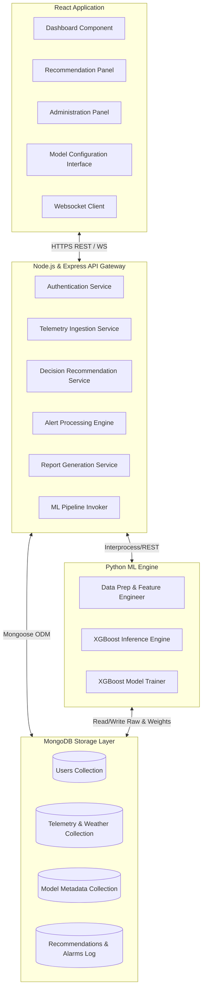
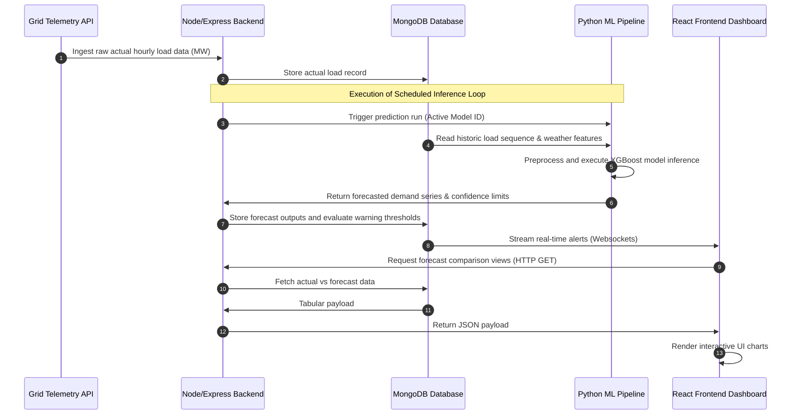
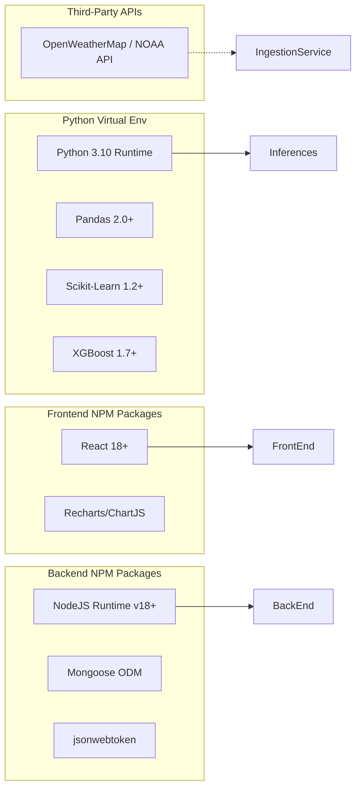

# Software Requirements Specification (SRS)

## Project Title
**AI-Based Smart Electricity Demand Forecasting and Grid Decision Support System**

---

## 1. System Scope

### 1.1 Document Purpose
This Software Requirements Specification (SRS) document establishes the comprehensive functional, non-functional, operational, and architectural requirements for the AI-Based Smart Electricity Demand Forecasting and Grid Decision Support System. It serves as the primary technical baseline and agreement for engineering, testing, and project management teams.

### 1.2 System Purpose and Vision
The system is designed for utility companies, electricity boards, and grid dispatch operators to manage grid stability, minimize operational costs, and streamline load management. By using machine learning models (specifically XGBoost) to forecast demand, and integrating telemetry and weather data, the system predicts electricity consumption across various time scales and yields action-oriented decision recommendations (e.g., peak shaving, load shedding, generator startups).

### 1.3 In-Scope Boundaries
* **Telemetry Data Ingestion**: Automated import of hourly historical grid load data (MW) and regional weather telemetry.
* **Predictive Analytics Engine**: Machine learning pipeline based on Python, Pandas, and XGBoost to generate short-term (hourly, daily) and medium-term (weekly, monthly) demand forecasts.
* **Grid Load Visualizations**: Interactive React dashboard providing charts of historical trends, active forecasts, prediction intervals, and threshold warnings.
* **Peak Demand Detection**: Algorithmic identification of load spikes exceeding grid limits, triggering real-time UI alarms.
* **Decision Support Recommendations**: Generation of operational proposals for load shedding, auxiliary generator startups, storage battery dispatch, and demand-response events.
* **Reporting & Auditing**: Generation of exportable PDF summaries and CSV files of forecasts and historical operational metrics.
* **Model Retraining Configurator**: GUI interface for adjusting hyper-parameters and initiating baseline model retraining.

### 1.4 Out-of-Scope Boundaries
* **SCADA Command Execution**: The system is strictly a *decision support tool*. It does not send direct physical control signals (e.g., breaker trip, generator switch-on) to SCADA or substation equipment.
* **Billing and Customer Management**: The system does not interface with end-user utility billing accounts, smart meter billing systems, or tariff collection platforms.
* **Direct Energy Trading Execution**: The system does not execute financial transactions on energy wholesale markets, though it can advise on peak pricing avoidance.

---

## 2. Functional Requirements

### 2.1 Core Forecasting Engine (FE)
* **FE-1: Multiscale Ingestion**: The system must ingest historical load metrics (MW) and external weather telemetry (temperature, relative humidity, solar irradiance, wind speed) from the integrated database.
* **FE-2: Multi-Horizon Forecasting**: The system must generate forecasting outputs at three granularities:
  * *Short-Term*: Hourly predictions for the next 24 to 72 hours.
  * *Medium-Term*: Daily aggregate predictions for the next 7 to 30 days.
  * *Long-Term*: Monthly aggregate predictions for the next 3 to 12 months.
* **FE-3: Confidence Intervals**: Every forecasting output must be generated with a corresponding 95% confidence interval boundaries.
* **FE-4: On-Demand Retraining**: Energy Analysts must be able to trigger model retraining via the user interface using a specified historic dataset range.

### 2.2 Visualization & Dashboard (VD)
* **VD-1: Interactive Multi-Series Charts**: The user interface must plot historical demand data, current live metrics, and predicted demand curves on a single time-series canvas.
* **VD-2: Detail-on-Demand Tooltips**: Hovering over any data point must present precise timestamped load metrics, weather covariates, and the forecasting model name version used.
* **VD-3: Dynamic Zoom and Filtering**: Users must be able to toggle the chart view range from 24 hours up to 1 year using quick-range buttons or custom date pickers.
* **VD-4: Exceedance Threshold Visualization**: Safe grid operational limits (in MW) must be rendered as horizontal warning lines on the forecasting charts.

### 2.3 Peak Demand Detection & Alerting (PA)
* **PA-1: Threshold-Based Alert Generation**: The system must automatically flag any predicted or real-time load value that exceeds 90% (Warning) and 98% (Critical) of local substation capacity.
* **PA-2: Warning Notifications**: Visual alarms must persist on the Grid Operator's dashboard detailing the timestamp, predicted peak load value, and time remaining until the threshold breach.
* **PA-3: Alert History Audit Log**: The system must record every threshold crossing event, including operator acknowledgement status, timestamp, and duration of the event.

### 2.4 Decision Support Engine (DSE)
* **DSE-1: Automated Load-Shedding Suggestions**: When critical peaks are predicted, the system must generate a structured mitigation plan detailing target sub-grids and suggested megawatt reductions.
* **DSE-2: Generator Startup Recommendations**: The engine must recommend auxiliary generator power additions (specifying MW capacity and target startup time) to avoid grid collapse.
* **DSE-3: Battery Storage Dispatch Recommendations**: The system must recommend charging periods (during low demand) and discharge profiles (during peak demand) for grid-tied energy storage systems.
* **DSE-4: Manual Recommendation Status Tracking**: Operators must be able to flag each generated recommendation as "Accepted", "Rejected", or "Modified".

### 2.5 Reporting & Exporting (RE)
* **RE-1: PDF Export**: Users must be able to download a PDF report containing a summary of demand peaks, model accuracy statistics, system actions, and charts for selected date ranges.
* **RE-2: CSV Export**: Users must be able to download raw tabular data containing timestamp, historical actual load, weather variables, predicted load, and confidence intervals.
* **RE-3: Scheduled Report Deliveries**: The system must allow administrators to schedule weekly/monthly executive summaries to be generated and stored on disk.

### 2.6 User & Admin Settings Management (AM)
* **AM-1: User Provisioning**: Administrators must have interfaces to create, update, deactivate, and assign roles (Administrator, Grid Operator, Energy Analyst) to user accounts.
* **AM-2: Substation Capacity Configurator**: Administrators must be able to set and modify the maximum megawatt capacity ratings for target grid sectors.

---

## 3. Non-Functional Requirements

### 3.1 Usability
* **US-1: System Learnability**: The user interface must be intuitive, requiring less than 4 hours of training for a grid operator to master dashboards and recommendation workflows.
* **US-2: Responsive Design**: The UI must adapt seamlessly to screen resolutions ranging from 1280x720 up to 4K multi-monitor layouts commonly used in utility control rooms.
* **US-3: Dark Mode Support**: A high-contrast dark theme must be available to minimize eye strain for operators working 12-hour night shifts.

### 3.2 Reliability & Availability
* **RL-1: High Availability**: The system must maintain a 99.9% uptime (excluding scheduled maintenance windows), corresponding to less than 8.76 hours of unplanned downtime per year.
* **RL-2: Data Fallback Operations**: If external live weather feeds fail, the system must automatically degrade to a secondary persistence forecasting mode using historical average weather variables.
* **RL-3: Database Auto-Reconnect**: The backend must recover gracefully from database disconnections, queuing local metrics and retrying the connection every 15 seconds.

### 3.3 Scalability & Portability
* **SC-1: Data Scaling Capacity**: The backend and database must support querying across at least 10 years of hourly historical load and weather telemetry without performance degradation.
* **SC-2: Execution Isolation**: Python-based model training and inference scripts must run in isolated worker processes so that long training cycles do not block backend API server response loops.
* **SC-3: Cross-Platform Compatibility**: The frontend must load and execute identically across all modern WebKit and Blink-based browsers (Google Chrome, Microsoft Edge, Safari, Firefox).

---

## 4. Complete User Roles

The system designates three key roles, with strict Role-Based Access Control (RBAC) enforced on the backend:

| Role | Core Purpose | Access Permissions |
| :--- | :--- | :--- |
| **Administrator** | Manages system setup, configurations, user credentials, database health, and integrations. | Full read/write access to user management, database connection strings, audit logs, and global system variables. |
| **Grid Operator** | Monitors real-time grids, manages alarms, reviews operational guidance, and records grid state actions. | Read access to forecasting models. Full read/write access to recommendations, alarm acknowledgments, and operational event tags. No access to user management or hyper-parameter inputs. |
| **Energy Analyst** | Configures modeling pipelines, reviews performance indicators, executes ad-hoc forecasts, and handles model tuning. | Read access to real-time status. Full read/write access to model hyper-parameter forms, retraining triggers, data validation rules, and report generation controls. No access to user account administration. |

---

## 5. Complete User Stories

### 5.1 Administrator Stories
* **US-AM-1: User Provisioning**
  * *As an* Administrator,  
  * *I want to* add a new user profile and assign them a specific role (e.g., Grid Operator),  
  * *So that* they can log in and view dashboards matching their operational responsibilities.
  * **Acceptance Criteria**:
    * Admin inputs name, email, and selects role from a dropdown.
    * System generates a secure activation link.
    * Database records the user under the proper RBAC group.
* **US-AM-2: Substation Threshold Configuration**
  * *As an* Administrator,  
  * *I want to* update the maximum capacity limits of a substation sector,  
  * *So that* the alarm limits adjust to newly upgraded physical transformers.
  * **Acceptance Criteria**:
    * System accepts capacity value updates in Megawatts (MW).
    * Limit modifications take effect immediately for new forecasts.
    * Event is logged in the system audit trail.

### 5.2 Grid Operator Stories
* **US-GO-1: Dashboard Monitoring & Peak Alerts**
  * *As a* Grid Operator,  
  * *I want to* view live demand vs. forecast curves with threshold lines,  
  * *So that* I can visually identify potential overload conditions before they occur.
  * **Acceptance Criteria**:
    * The dashboard updates in real-time with zero manual refreshes.
    * An visual warning alert pops up within 5 seconds if a forecast exceeds the 90% threshold.
* **US-GO-2: Action Recommendation Execution**
  * *As a* Grid Operator,  
  * *I want to* review and accept or reject operational recommendations,  
  * *So that* the system knows which load mitigation actions are being executed.
  * **Acceptance Criteria**:
    * Operator clicks "Accept" or "Reject" on recommendation cards.
    * Operator can append a text note explaining the decision.
    * Recommendation status changes to "Executing" or "Closed".

### 5.3 Energy Analyst Stories
* **US-EA-1: Hyper-parameter Selection & Model Retraining**
  * *As an* Energy Analyst,  
  * *I want to* adjust XGBoost training hyper-parameters and trigger a retraining session,  
  * *So that* I can improve forecast accuracy during season transitions.
  * **Acceptance Criteria**:
    * Interface displays parameters (max_depth, learning_rate, n_estimators).
    * Retraining executes in a background thread without impacting dashboard API performance.
    * Completion displays comparative metrics (MAPE, RMSE) against the active baseline model.
* **US-EA-2: Historical Performance Auditing**
  * *As an* Energy Analyst,  
  * *I want to* plot historical actual demands against predictions from past cycles,  
  * *So that* I can evaluate accuracy drifts over the last quarter.
  * **Acceptance Criteria**:
    * Analyst selects date range and model version.
    * Chart overlay plots actual demand (solid) against forecasted demand (dashed).
    * Metric cards display Average Error rate and MAPE.

---

## 6. Use Cases

### 6.1 Use Case 1: Run Retraining Job
* **Actor**: Energy Analyst
* **Preconditions**:
  * Analyst is authenticated and authorized (RBAC token validation).
  * Valid historic dataset is present in MongoDB.
* **Trigger**: Analyst clicks "Execute Retraining" after inputting parameter variables.
* **Main Success Scenario**:
  1. Analyst navigates to the Model Tuning panel.
  2. System displays current baseline hyper-parameters and training data limits.
  3. Analyst edits learning rate and selects the data window (e.g., past 24 months).
  4. Analyst submits the request.
  5. System validates inputs and spawns a background Python training process.
  6. UI indicates training progress.
  7. Python process finishes, saves the new model weights, and writes evaluation metrics to the database.
  8. UI displays "Retraining Completed" and presents the new validation statistics.
* **Alternative Flows**:
  * *Data Insufficiency (Step 5)*: If selected range has less than 90% complete data, the system aborts, alerts the analyst, and lists missing dates.
  * *Hyper-parameter Out of Range (Step 4)*: If inputs fail boundary checks, the UI highlights invalid inputs and blocks submission.

### 6.2 Use Case 2: Manage Peak Demand Alert
* **Actor**: Grid Operator
* **Preconditions**:
  * Forecast generation loop has executed, indicating a threshold breach in the next 12 hours.
* **Trigger**: System pushes alert flag to active client websocket.
* **Main Success Scenario**:
  1. Dashboard flashes a red warning alert on the operator screen.
  2. Operator clicks the alert card to expand details.
  3. System shows the sub-grid name, predicted load peak, confidence interval, and estimated breach time.
  4. System shows three recommended mitigation paths generated by the Decision Support Engine.
  5. Operator reviews recommendations and clicks "Accept" on the load-shedding proposal.
  6. System prompts for confirmation note.
  7. Operator inputs details and confirms.
  8. Alarm state transitions to "Acknowledged - Mitigation Initiated", and visual indicator turns from flashing red to steady orange.
* **Alternative Flows**:
  * *False Alarm (Step 5)*: Operator marks the alert as a "False Positive". Alarm closes, requiring a text explanation for audit purposes.

---

## 7. Module Breakdown



### 7.1 Frontend Modules (React.js)
* **Dashboard View**: Manages the multi-series line graphs using modern charting libraries, including state selectors for time scales, zoom controls, and overlay filters.
* **Recommendation Panel**: Displays generated advisory cards with clear interactive actions (Accept, Reject, Modify) and status indicators.
* **Model Configurator Interface**: Provides input forms with validation boundaries for hyper-parameters, and progress indicators for retraining.
* **Websocket Client**: Maintains a persistent connection to the backend to process instant threshold alerts.

### 7.2 Backend Modules (Node.js/Express.js)
* **Authentication Service**: Handles user login, password hashing, JWT signing, verification, and RBAC middleware checking.
* **Telemetry Ingestion Service**: Exposes secure endpoints for hourly uploads of load telemetry and weather data.
* **Alert Processing Engine**: Evaluates current actual and predicted loads against configured substation capacities, raising alert flags in the database and streaming them to clients.
* **Decision Recommendation Service**: Matches predicted demand peaks with available resource assets (generators, batteries, load-shedding agreements) to compile recommendations.
* **Python Pipeline Invoker**: Manages execution and termination of the Python forecasting and training processes.

### 7.3 Machine Learning Pipeline (Python/Pandas/Scikit-Learn/XGBoost)
* **Data Preprocessing & Feature Engineering**: Handles missing values, scaling, lag variables, rolling features, calendar feature extraction (hour of day, day of week, holidays), and temperature features.
* **Inference Engine**: Executes scheduled prediction queries using the active XGBoost model weights to produce load forecasts and confidence intervals.
* **Model Trainer**: Performs background model fitting, cross-validation, and performance scoring.

---

## 8. Assumptions
* **Telemetry Availability**: Grid monitoring units (RTUs) provide hourly average readings without prolonged network dropouts.
* **Weather Service SLA**: Third-party weather forecasting services maintain an API availability of 99.5% with hourly update cycles.
* **Holiday Calendars**: Regional and national holiday data calendars are available to feed calendar-specific features to the XGBoost model.
* **Infrastructure Reliability**: Server nodes run on reliable power with standard uninterruptible power supplies (UPS), ensuring local server reboots are rare.

---

## 9. Limitations
* **Black Swan Anomalies**: The model cannot predict demand variations resulting from unprecedented structural shocks (e.g., sudden pandemic lockdowns, catastrophic regional grid physical damage).
* **Weather Accuracy Dependence**: The forecasting accuracy of the demand model degrades in direct proportion to the error rate of the weather forecasting service.
* **XGBoost Extrapolation**: Tree-based models (XGBoost) cannot extrapolate trends beyond the minimum and maximum ranges found in training sets; hence, unprecedented peak demands may be under-predicted unless features are normalized.
* **No Direct Control Integrations**: System outputs remain strictly advisory; the platform relies entirely on operators to execute proposed physical actions.

---

## 10. Risks
* **Data Drift Risk**: Rapid changes in user consumption (e.g., fast deployment of local rooftop solar and electric vehicle charging stations) may render historical training patterns obsolete.
  * *Mitigation*: Weekly scheduled retraining validation loops to monitor accuracy trends and prompt retraining when error margins widen.
* **Weather API Service Interruption**: External weather APIs going offline or changing schemas during runtime.
  * *Mitigation*: Build a robust local caching database of weather data and design a fallback mechanism that utilizes historical seasonal weather averages.
* **Inconsistent Telemetry Timestamps**: Discrepancies between different substation timezones and daylight saving transitions.
  * *Mitigation*: Standardize all database operations and machine learning features strictly using Coordinated Universal Time (UTC).

---

## 11. Future Scope
* **Closed-Loop SCADA Interface**: Developing secure, protocol-compliant API channels (e.g., DNP3, IEC 61850) to directly execute grid balance operations in emergency situations.
* **Renewable Energy Generation Forecasting**: Integrating parallel prediction models for solar irradiance and wind velocity to forecast green energy input levels.
* **Geographical Information System (GIS) Overlay**: Mapping demand forecasts onto interactive geographical layouts, enabling grid load visualization across physical transmission pathways.
* **Deep Learning Integration**: Incorporating sequential neural networks (such as Temporal Fusion Transformers or LSTMs) to assess performance improvements over XGBoost for long-term forecasts.

---

## 12. Data Flow Overview



### 12.1 Detailed Data States
1. **Raw Telemetry**: Ingested via API payloads in UTC ISO 8601 formats. Unstructured telemetry values are validated before parsing.
2. **Processed Features**: Cleaned, lagged, and scaled numerical matrices stored in MongoDB, optimized for fast Pandas input.
3. **Inference Outputs**: JSON arrays containing forecast points, datetime markers, upper/lower bounds, and the originating model identifier.
4. **Advisory Alerts**: System flags containing state tags (`ACTIVE`, `ACKNOWLEDGED`, `RESOLVED`, `FALSE_POSITIVE`).

---

## 13. High-Level Architecture Description

The system employs a decoupled, multi-tier microservices-inspired architecture designed to optimize separation of concerns and computational efficiency:

* **Presentation Layer (React Frontend)**: A single-page application (SPA) optimized for client-side state handling. It interacts with the backend strictly via standard JSON HTTP REST endpoints and persistent Websockets. Styling is applied using a functional design framework to ensure consistency.
* **Application Gateway & Business Logic Layer (Node.js/Express.js)**: Runs an event-driven Express API server. Responsible for handling incoming telemetry payloads, managing user sessions and access permissions, orchestrating workflow state changes, running reporting pipelines, and scheduling tasks.
* **Machine Learning Execution Engine (Python)**: An isolated analytical runtime containing ML libraries (Pandas, Scikit-learn, XGBoost). It is called by the application layer using secure RPC-like subprocess configurations or local HTTP loops. It uses multi-threaded compilation to perform fast numerical calculations without blocking user request threads.
* **Persistence Layer (MongoDB Database)**: Document-oriented database storing telemetry, user profiles, alert logs, model configurations, and historical forecasting metrics.

---

## 14. External Dependencies



### 14.1 Key Package Integrations
* **ML Libraries**: `xgboost` (gradient boosting), `scikit-learn` (data scaling and split evaluation), `pandas` (feature engineering and timeseries alignment).
* **Data Visualization**: `recharts` or `chart.js` (for interactive, high-performance line charts inside the React layout).
* **Document Compilation**: `pdfkit` or `puppeteer` (used by the backend to compile formatted demand summary reports).
* **Security & Tokens**: `bcryptjs` (secure password hashing) and `jsonwebtoken` (stateless user session tokens).

---

## 15. Security Requirements

### 15.1 Authentication & Authorization
* **RBAC Enforcement**: The backend must evaluate user group classifications (Admin, Operator, Analyst) before executing route requests.
* **Token Configuration**: Session tokens (JWT) must expire after 8 hours. Tokens must be stored in secure HTTP-only cookies to mitigate Cross-Site Scripting (XSS) risks.
* **Password Complexity**: Users must maintain passwords of at least 12 characters, including capital letters, numbers, and special characters.

### 15.2 Data Integrity & Transmission
* **TLS Security**: All system communication must be encrypted using TLS 1.3 protocol standards. Port 80 must redirect automatically to Port 443.
* **Database Encrypted Volumes**: MongoDB database volumes must employ AES-256 encryption at rest.
* **IP Whitelisting**: Telemetry ingestion routes must be restricted to configured IP addresses matching utility server nodes.

### 15.3 Session & Protection Rules
* **Strict CORS**: Cross-Origin Resource Sharing (CORS) rules must block all requests originating from non-whitelisted domain spaces.
* **NoSQL Injection Prevention**: Mongoose ODM schemas must enforce sanitization, stripping potential NoSQL injection operators (e.g., `$gt`, `$ne`) from query parameters.
* **Rate Limiting**: Public API routes must limit requests to a maximum of 100 requests per 15-minute window per IP to prevent Denial of Service (DoS) attempts.

---

## 16. Validation Requirements

### 16.1 Telemetry Data Validation (Ingestion Layer)
* **Range Boundaries**: Data ingestion must reject individual load entries that are negative or exceed 150% of the historical maximum grid demand.
* **Timestamp Format**: Rejects payloads containing timestamps that deviate from ISO 8601 formatting or specify future datetimes.
* **Missing Value Imputation**: For minor telemetry gaps (up to 3 consecutive hours), the ingestion layer must impute values using linear interpolation. Gaps wider than 3 hours must be flagged, prompting manual review before inclusion in training sets.

### 16.2 Model Validation & Retraining Standards
* **Accuracy Thresholds**: A retrained model must achieve a Mean Absolute Percentage Error (MAPE) of less than 4.5% on the out-of-sample validation split before it can be activated as the system baseline model.
* **Cross-Validation**: Retraining procedures must use a 5-fold time-series split to prevent temporal data leakage.

---

## 17. Error Handling Requirements

### 17.1 Standard API Response Error Payload
Every API failure must yield a structured response detailing error classifications while hiding internal system stack traces:
```json
{
  "success": false,
  "errorCode": "VAL_DATE_OUT_OF_RANGE",
  "message": "The selected start date cannot be later than the end date.",
  "timestamp": "2026-07-18T22:05:22Z"
}
```

### 17.2 Component-Specific Failure Mitigations
* **Database Offline**: In the event MongoDB is unreachable, the API gateway must respond with a HTTP 503 Service Unavailable code, display a "Read-Only Archive Mode" alert on the frontend, and begin connection retry loops.
* **Inference Pipeline Fault**: If the Python inference script crashes, the system must trigger a fallback persistence method (e.g., using the average load profile of the same day of the week from the previous month) and flag the event as an unresolved ML Pipeline error.
* **External API Outage**: If the weather forecast API fails, the backend must use cached weather data from the last successful API poll or fall back to historical seasonal averages.

---

## 18. Logging Requirements

### 18.1 Log Format Standard
Logs must write to standardized output streams in JSON format, facilitating aggregation by log management tools:
```json
{
  "timestamp": "2026-07-18T16:35:26.124Z",
  "level": "ERROR",
  "service": "api-gateway",
  "requestId": "req-987a-654c",
  "userId": "usr_6782_op",
  "message": "Database query timeout after 5000ms",
  "context": {
    "collection": "telemetry",
    "query": { "timestamp": { "$gt": "2026-07-01T00:00:00Z" } }
  }
}
```

### 18.2 Log Severity Matrix

| Severity | Operational Usage | Storage Output |
| :--- | :--- | :--- |
| **DEBUG** | Verbosely logs internal steps, SQL/NoSQL query constructions, and model feature metrics. | Console stream (disabled in production environments). |
| **INFO** | Records login actions, model generation completions, and generated reports. | Daily rotated storage files (`info.log`). |
| **WARN** | Tracks input boundary exceptions, single weather API timeouts, and warning threshold alerts. | Rotated warning files (`warn.log`) and active alert tables. |
| **ERROR** | Logs DB access failures, model evaluation failures, and pipeline command execution errors. | Immediate write to `error.log` and alerts system administrators via notification systems. |
| **FATAL** | System-wide failures (e.g., memory exhaustion, server crash, database corruption). | Direct push to console error stream, application exit, and notification dispatch. |

### 18.3 Audit Trails
The system must log all administrative and operational activities (e.g., user creations, changes to capacity thresholds, recommendation acknowledgements) in a read-only database log collection. These log entries must contain the original state, the modified state, the user ID, and an IP address, and must not be editable or deletable by any user.

---

## 19. Performance Requirements

### 19.1 System Latencies & Responsiveness
* **API Route Response Times**: Standard backend API requests must return response payloads within 200 milliseconds (under 50 concurrent requests).
* **Inference Pipeline Latency**: Calculating a standard 72-hour forecast sequence using an active model must take less than 1.5 seconds from initialization to payload return.
* **Dashboard Load Efficiency**: The main dashboard page must load and render UI components within 2 seconds of login.
* **Retraining Job Isolation**: Retraining operations must run as background processes, consuming no more than 60% of available CPU cores to prevent system slowdowns.

### 19.2 Scalability Target Boundaries
* **Concurrent Operator Capacity**: The application server must support at least 100 concurrent active operator WebSocket connections without connection degradation.
* **Database Performance**: Query response times for fetching 12 months of historical load data must remain under 1 second using structured indexes on timestamps and substation IDs.

---

## 20. Maintainability Guidelines

### 20.1 Code Quality Standards
* **Static Analysis**: JavaScript/React code must pass ESLint configuration checks. Python code must conform to PEP8 standards verified by flake8 or pylint.
* **Component Modularity**: React components must be designed using single-responsibility principles. Styling must be managed via modular utility classes (Tailwind CSS) to prevent redundant CSS rules.
* **Documentation**: Clean code structures must be documented using JSDoc for Node/Express interfaces and PEP 257 docstring standards for Python forecasting modules.

### 20.2 Model Lifecycle Management
* **Model Versioning**: Saved models must use a versioning format (`model_v[MAJOR].[MINOR]`) to track parameters, training dates, and evaluation scores.
* **Decoupled Workspaces**: Machine learning script pathways must be isolated from API route code to facilitate independent package updates without affecting core system operations.
